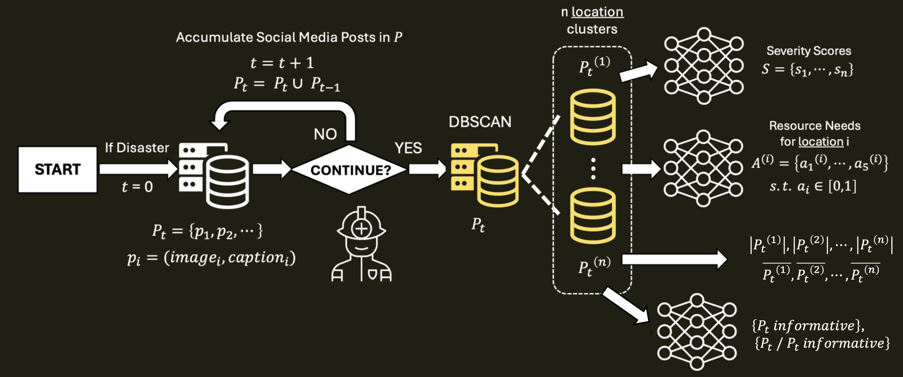

# ResNet — Post-Crisis Resource Allocation System



An end-to-end machine learning system that analyzes social media posts during and right after disasters to predict emergency resource needs from differing clusters and visualize them on an interactive map for better resource strategistion (e g. how to distribute their limited personnels across different victim clusters). Combines multimodal deep learning (CLIP), spatial clustering (DBSCAN), and a trained neural network classifier with a React + Leaflet frontend and LLM-powered crisis summaries.

## Tech Stack

**Backend:** Python, Flask, PyTorch, CLIP ViT-B/32, ViT (damage severity), scikit-learn (DBSCAN), OpenAI API
**Frontend:** React 19, TypeScript, Vite 7, Tailwind CSS 4, Leaflet, Zustand, React Query

## Quick Start

### Prerequisites

- Python 3.10+
- Node.js 18+
- (Optional) CUDA-capable GPU or Apple Silicon for faster inference

### Installation

```bash
# Python dependencies
pip install -r requirements.txt

# Frontend dependencies
cd resnet
npm install
```

### Running the Demo

```bash
# Terminal 1 — Backend API server
python demo_backend.py --sample 500 --model checkpoints/model.pt --severity-model checkpoints/vit-crisis-damage-final --port 8000

# Terminal 2 — Frontend dev server
cd resnet
npm run dev
# Open http://localhost:5173
```

### Training a New Model

```bash
# 1. Prepare data from CrisisMMD dataset
python prepare_data.py --crisismmd CrisisMMD_v2.0 --output data/posts.csv --sample 1000

# 2. Generate pseudo-labels with GPT-4o (requires OPENAI_API_KEY in .env)
python generate_labels.py --data-dir CrisisMMD_v2.0 --csv data/posts.csv --output data/labels.json

# 3. Train the model
python train.py --labels data/labels.json --data-dir CrisisMMD_v2.0 --epochs 200 --output checkpoints/model.pt
```

## Architecture

```
Crisis Social Media Posts (image + caption + coordinates)
        │
        ▼
   DBSCAN Clustering (geographic grouping)
        │
        ▼
   CLIP ViT-B/32 Encoder
   ├── Image  → 512-dim embedding
   └── Caption → 512-dim embedding
        │
        ▼ concatenate (1024-dim)
        │
   ResourceClassifier (MLP: 1024→512→256→5)
        │
        ▼
   Per-post resource scores:
   [infrastructure, food, shelter, sanitation_water, medication]
        │
        ▼
   ViT Damage Severity Classifier (ViT-B/16, 3-class)
   → little_or_none | mild | severe
        │
        ▼
   Cluster-level aggregation + weighted severity
        │
        ▼
   Flask API (REST + SSE streaming)
        │
        ▼
   React Frontend (Leaflet map with real-time visualization)
```

## Key Innovations

1. **GPT-4o Pseudo-Labeling** — Generates continuous (0.0–1.0) resource need scores from crisis images without manual annotation, using carefully designed prompts with scoring guidelines and examples.

2. **Multimodal CLIP Encoding** — Concatenates image and text embeddings from CLIP ViT-B/32 into a 1024-dim feature vector, capturing both visual damage and textual context.

3. **ViT Damage Severity Classification** — A fine-tuned Vision Transformer (ViT-B/16) classifies each post's image into three damage severity levels (little_or_none, mild, severe), replacing heuristic-based severity estimation with learned visual features.

4. **Real-Time SSE Streaming** — Server-Sent Events stream inference progress to the frontend, enabling live marker animation as posts are analyzed.

5. **Interactive Timeline Slider** — After analysis, scrub through posts chronologically to see how resource demands evolve over time, with on-the-fly severity recomputation.

6. **LLM Crisis Summary** — After inference, the `/api/summarize` endpoint sends cluster-level resource scores to an LLM to generate a natural-language situation analysis with actionable insights.

## Project Structure

```
├── train.py              # Training pipeline (BCE loss, early stopping, LR scheduling)
├── model.py              # ResourceClassifier MLP (1024→512→256→5 with sigmoid)
├── encoder.py            # CLIP ViT-B/32 wrapper for image/text encoding
├── clustering.py         # DBSCAN spatial clustering
├── data_collector.py     # Post/Call data structures
├── prepare_data.py       # CrisisMMD TSV → CSV conversion
├── generate_labels.py    # GPT-4o pseudo-labeling script
├── demo_backend.py       # Flask API server with SSE streaming
├── main.py               # Standalone demo script
├── requirements.txt      # Python dependencies
├── resnet/               # React + TypeScript frontend
│   ├── src/
│   │   ├── components/
│   │   │   ├── map/           # Map, PostMarkers, ClusterPopup, AnalysisSidebar, HeatMap
│   │   │   └── widgets/       # GlassCard, StatCard, TimerCard, InferenceWidgets
│   │   ├── types/           # TypeScript interfaces (Post, Cluster, Crisis)
│   │   ├── store/           # Zustand stores (posts, predict, map, filter, crisis)
│   │   └── hooks/           # Custom hooks (usePosts, usePredict, useMapClusters)
│   ├── package.json
│   └── vite.config.ts
├── CrisisMMD_v2.0/       # Dataset (not included)
├── checkpoints/
│   ├── model.pt                    # ResourceClassifier weights
│   └── vit-crisis-damage-final/    # ViT severity classifier (HuggingFace format)
└── documentation/        # LaTeX documentation
```

## Dataset

Uses [CrisisMMD](https://crisisnlp.qcri.org/crisismmd), a multimodal crisis dataset covering 7 major 2017 disasters: Hurricane Harvey, Hurricane Irma, Hurricane Maria, Mexico Earthquake, Iraq-Iran Earthquake, California Wildfires, and Sri Lanka Floods.

## API Endpoints

| Endpoint         | Method | Description                                                       |
| ---------------- | ------ | ----------------------------------------------------------------- |
| `/api/posts`     | GET    | Returns all posts with cluster assignments                        |
| `/api/predict`   | GET    | SSE stream — runs inference on all posts, streams progress events |
| `/api/summarize` | POST   | Generates an LLM-powered crisis situation summary                 |
| `/images/<path>` | GET    | Serves post images from the dataset                               |

## Environment Variables

```
OPENAI_API_KEY=sk-...   # Required for generate_labels.py and /api/summarize
```
